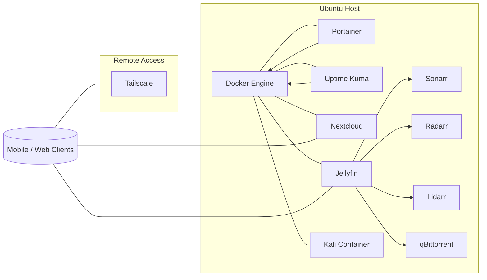

# 🏠 My Personal Homelab


[](LICENSE)

> A personal self-hosted environment built for automation, media management, cloud learning, and cybersecurity experimentation.

---

## 🧭 Table of Contents

- **Hardware Overview**
- **Current Setup**
  - Core Services: Nextcloud, Jellyfin (Sonarr/Radarr/Lidarr/qBittorrent), Portainer, Tailscale, Uptime Kuma
- **Learning & Experimentation**
- **Future Plans / Roadmap**
- **Vision Summary**
- **Repository Structure**
- **Architecture Overview**
- **Screenshots**
- **Author**
- **License**

---

## 🖥️ Hardware Overview

| Component | Specification |
|------------|---------------|
| **Device** | Lenovo Laptop |
| **CPU** | Intel Celeron N4000 (2 cores / 2 threads) |
| **RAM** | 4 GB (2.5 GB usable, 3.66 GB swap) |
| **Storage** | 465.8 GB HDD |
| **GPU** | Intel UHD 600 (for light desktop use) |

⚙️ The system runs efficiently on modest hardware, focusing on lightweight containers and automation.

---

## ⚙️ Current Setup

- **OS**: Ubuntu  
- **Containerization**: Docker (managed via Portainer)  
- **Remote Access**: Tailscale  
- **Monitoring**: Uptime Kuma  

### Core Services

#### 🗂️ Nextcloud
Personal cloud used for:
- File backups  
- Photo and video storage  
- Contact management  

#### 🎬 Jellyfin
Handles all media management and playback:
- Integrated with:
  - **Sonarr** – TV show automation  
  - **Radarr** – Movie automation  
  - **Lidarr** – Music automation  
  - **qBittorrent** – Torrent handling  
- Fully automated for fetching, organizing, and serving media  
- Connected with **Ordinary App** for enhanced UI and access  

---

## 🧠 Learning & Experimentation Environment

This lab doubles as a hands-on learning platform.

### 🔐 Kali Linux Container
- Dedicated sandbox for security testing, ethical hacking, and network troubleshooting  
- Used to safely break, test, and fix configurations  
- Supports real-world cybersecurity training  

### ☁️ Cloud Engineering
- Practicing AWS and hybrid setups locally  
- Testing deployments, container networking, and automation scripts  
- Experimenting with CI/CD concepts using lightweight infrastructure  

🧪 The goal: to learn by building, breaking, and rebuilding.

---

## 🚀 Future Plans / Roadmap

| Tool | Description |
|------|--------------|
| **MeTube** | Browser-based video downloader for tutorials and learning content |
| **PodGrab** | Podcast downloader with library integration |
| **Home Assistant** | Smart home and IoT automation experiments |
| **Hammond** | Self-hosted bookmark and knowledge management |
| **Google Calendar Integration** | Sync tasks and events with Nextcloud |
| **Neon** | Workflow automation and container orchestration |
| **Starlink PDF** | PDF and document automation system |
| **IT Tools Suite** | Networking and sysadmin utilities dashboard |

Each addition is aimed at enhancing automation, self-sufficiency, and technical learning.

---

## 🧩 Vision Summary

This homelab currently serves as a:
- Private cloud (Nextcloud)
- Automated media hub (Jellyfin stack)
- Secure remote lab (Tailscale + Kali)
- Monitoring and uptime system (Uptime Kuma)

Planned expansions will transform it into a complete self-hosted tech ecosystem:
- Automation-first
- Cloud-integrated
- Security-aware
- Learning-driven

💡 A sandbox for exploring everything tech — from Docker to DevOps to cybersecurity.

---

## 📂 Repository Structure

Below is the current repository structure followed by a suggested layout as the project grows.

### Current
```text
/
├── LICENSE
└── README.md
```

### Suggested (scales with features)
```text
/
├── containers/                # Per-service Docker Compose stacks
│   ├── nextcloud/
│   │   ├── docker-compose.yml
│   │   └── README.md
│   ├── jellyfin/
│   │   ├── docker-compose.yml
│   │   └── README.md
│   ├── sonarr/  radarr/  lidarr/  qbittorrent/
│   ├── uptime-kuma/  portainer/
│   └── traefik/                 # (optional) reverse proxy + TLS
│
├── scripts/                   # Utilities for backups, maintenance, bootstrap
│   ├── backups/
│   ├── maintenance/
│   └── bootstrap.sh
│
├── ansible/                   # (optional) infra-as-code for provisioning
│   ├── inventories/
│   ├── roles/
│   └── playbooks/
│
├── k8s/                       # (optional) if migrating to Kubernetes
│   ├── namespaces/
│   ├── apps/
│   └── networking/
│
├── docs/                      # Guides, runbooks, notes
│   ├── guides/
│   └── diagrams/
│
├── assets/                    # Images for README and docs
│   ├── portainer-dashboard.png
│   ├── jellyfin-ui.png
│   ├── nextcloud-ui.png
│   └── uptime-kuma.png
│
├── .env.example               # Example environment variables
├── LICENSE
└── README.md
```

> Note: Some folders are placeholders to guide future growth. Add them as services are introduced.

---

## 🗺️ Architecture Overview

A high-level view of how services interact inside the homelab.



---

## 🖼️ Screenshots

_Add screenshots or terminal previews here._

| Description | Screenshot |
|--------------|-------------|
| Portainer Dashboard |  |
| Jellyfin Media UI |  |
| Nextcloud Web Interface |  |
| Uptime Kuma Monitoring |  |

---

## 🧑‍💻 Author

**Sharon Wainaina**  
Tech Enthusiast | Cloud Learner | Automation Builder  
💬 Always experimenting. Always learning.

---

## 📄 License

This project is licensed under the **MIT License**. See [`LICENSE`](LICENSE) for details.

---

If this repo inspires you, consider starring it to follow along ⭐